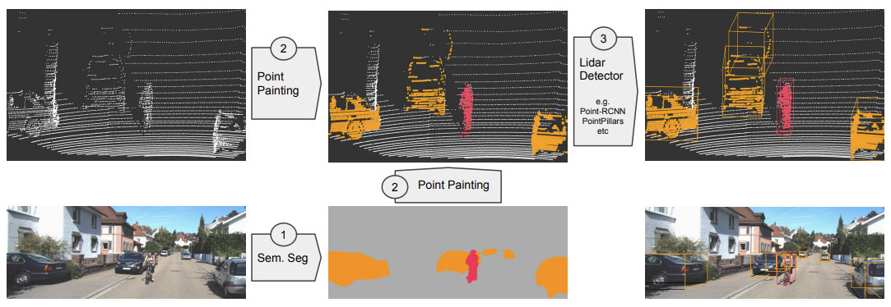
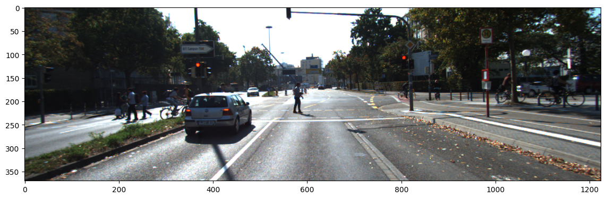
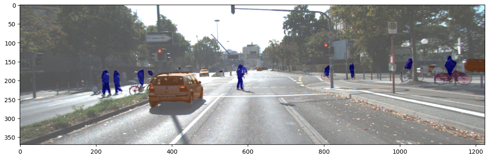
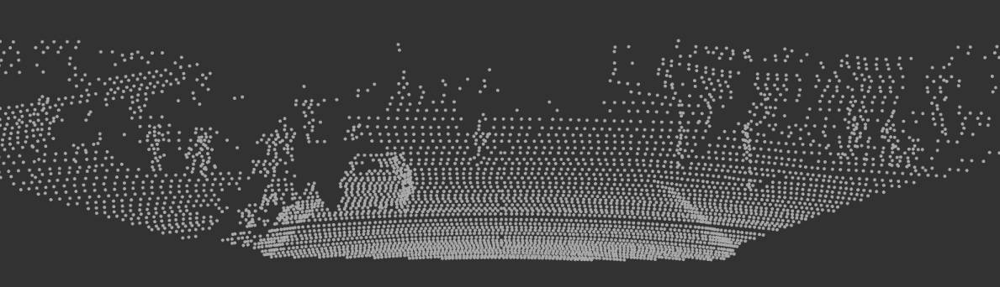
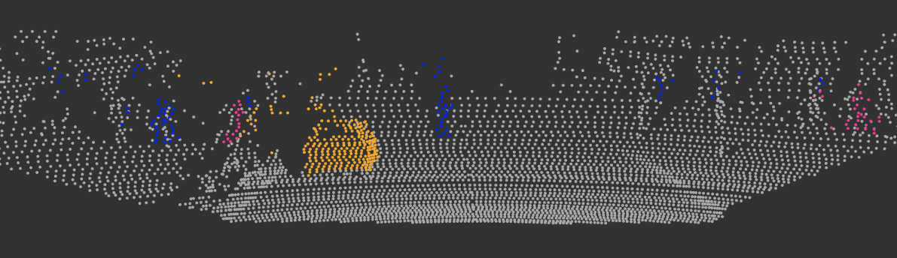
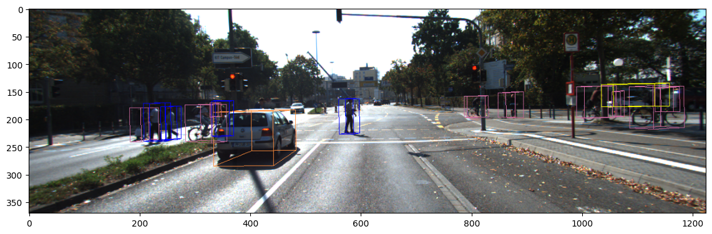
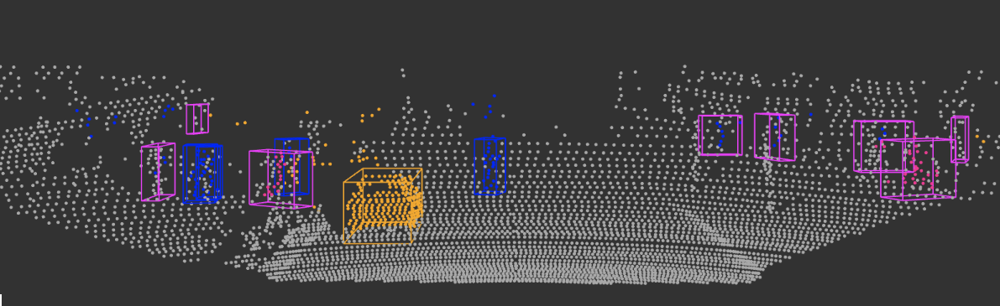

# 概要

本リポジトリは、[第6回AIエッジコンテスト](https://signate.jp/competitions/732)のリファレンス環境（ソフトウェア）です。  
PointPaintingの学習、推論環境及び、学習済みモデルを公開しています。

>
> リファレンス環境（ソフトウェア）は、段階的なリリースを予定しております。  
> 本リポジトリでは、Step1として、オープンデータKITTIを用いたリファレンス環境を構築しています。 
> PointPaintingの手法の理解にお役立てください。  
> Step2では、第6回AIエッジコンテストの配布データを用いたリファレンス環境を公開する予定です。

## 動作確認

次の環境で動作確認済みです。
- Ubuntu 20.04
- Python 3.8
- PyTorch 1.7.1
- GPU NVIDIA Tesla K80
- CUDA 11.3.1

また、環境構築にDockerコンテナをサポートしています。
詳しくは、[docker/README.md](docker/README.md)をご参照ください。

# PointPainting

[PointPaintingの論文](https://arxiv.org/abs/1911.10150)を参考に、カメラ画像から点群へのペインティング処理を行い、3D物体検出を実装しています。

画像のセマンティックセグメンテーションでは、PyTorch Hubの事前学習モデル[DeepLabV3](https://pytorch.org/hub/pytorch_vision_deeplabv3_resnet101/)を使用しています。また、点群データの3D物体検出では、[second.pytorch](https://github.com/traveller59/second.pytorch)をベースにPointPainting用に修正したvoxelnetを使用しています。

## 目次
- [概要](#概要)
  - [動作確認](#動作確認)
- [PointPainting](#pointpainting)
  - [目次](#目次)
  - [アーキテクチャ](#アーキテクチャ)
  - [インストール](#インストール)
  - [使い方](#使い方)
    - [データセットの用意](#データセットの用意)
    - [学習済みモデル](#学習済みモデル)
    - [ペインティング処理](#ペインティング処理)
    - [KITTIデータセットの前処理](#kittiデータセットの前処理)
    - [3D物体検出モデルの学習](#3d物体検出モデルの学習)
    - [3D物体検出モデルの推論](#3d物体検出モデルの推論)
    - [結果](#結果)


## アーキテクチャ

PointPaintingは、LiDARの点群データにカメラ画像からのセグメンテーションスコアを追加することで、点群のみのアプローチよりも高い精度を達成した3D物体検出の手法です。  





PointPainting アーキテクチャは、次の3つのステップで構成されています。

1. セマンティックセグメンテーション
2. 融合 (点群のペインティング)
3. 3D物体検出

第1ステップでは、カメラ画像に対して、セマンティックセグメンテーションを実行し、ピクセルごとのセグメンテーションスコアを取得します。  
第2ステップでは、セグメンテーションスコアをLidarの点群に投影し、セグメンテーションスコア(nクラス)を追加した拡張点群を取得します。このペインティング処理により、点群の次元は (x, y, z, r) から (x, y, z, r, C1,..  Cn) へと拡張されます。  
第3ステップでは、拡張点群から3D物体検出を行います。


## インストール

[docker/requirements.txt](docker/requirements.txt)に記載のライブラリをインストールします。

次に、spconv v1.2.1をインストールします。  
GitHubからspconv v1.2.1をクローンしてビルドとインストールを行います。
```
git clone --depth 1 --recursive https://github.com/traveller59/spconv.git -b v1.2.1
cd ./spconv
SPCONV_FORCE_BUILD_CUDA=1 python setup.py bdist_wheel 
pip install ./dist/spconv*.whl
```

## 使い方

### データセットの用意

下記のディレクトリ構成となるようにKITTIデータセットを用意します。  

```
└─ data
     └─ training    <-- 7481 train data
          ├── image_2
          ├── calib
          ├── label_2
          └── velodyne
```

[KITTI ダウンロードリンク](http://www.cvlibs.net/datasets/kitti/eval_object.php?obj_benchmark=3d)

ダウンロードが必要なファイルは次の通りです。
- Left Color images of object data set(12GB)
- Velodyne point clouds(29GB)
- camera calibration matrices(16MB)
- training labels of object data set(5MB)

なお、本リポジトリではtrainingデータのみを使用し、testingデータは使用しませんので、testingディレクトリの展開は不要です。

### 学習済みモデル

3D物体検出モデルは公開の学習済みモデルは、[Google Drive](https://drive.google.com/file/d/1uIC9u8nEDkQRsQEuvzVzYIst5azB_OIL/view?usp=sharing)よりダウンロードして利用することができます。
ダウンロードしたcheckpoints_pointpainting.zipを展開して、`pointpainting`ディレクトリを`second.pytorch/checkpoints`配下においてください。

```
└ second.pytorch
     └─ checkpoints
          └ pointpainting
                ├── summary
                ├── checkpoints.json
                ├── log.txt
                └── voxelnet-18570.tckpt
```


### ペインティング処理

カメラ画像に対してセグメンテーションを実施し、Lidarの点群データと結合した拡張点群を生成します。  
`notebook/1-1_painting_kitti.ipynb`を開き、コードを順番に実行してください。  
生成した拡張点群は、`velodyne_painted`ディレクトリに格納されます。

```
└─ data
     └─ training
          ├── image_2
          ├── calib
          ├── label_2
          ├── velodyne
          └── velodyne_painted  <- 生成されます
```


### KITTIデータセットの前処理

3D物体検出モデルの学習と推論を実行するための事前準備を行います。  
`notebook/1-2_create_dataset_kitti.ipynb`を開き、コードを順番に実行してください。  
削減した点群データ(velodyne_reduced)と、学習と推論に必要なデータセットのメタ情報ファイル(pkl)を生成します。

```
└─ data
     ├─ training
     |    ├── image_2
     |    ├── calib
     |    ├── label_2
     |    ├── velodyne
     |    ├── velodyne_painted
     |    └── velodyne_reduced  <- 生成されます
     ├ kitti_gt_database        <- 生成されます
     ├ kitti_infos_train.pkl    <- 生成されます
     ├ kitti_infos_val.pkl      <- 生成されます
     └ kitti_infos_trainval.pkl <- 生成されます
```

### 3D物体検出モデルの学習

3D物体検出モデルの学習を行います。  
`notebook/1-3_trai_kitti.ipynb`を開き、コードを順番に実行してください。  
拡張点群を入力として、3D物体検出モデルの学習を実行します。  
`second.pytorch/checkpoints/{model_dir}` ディレクトリに学習結果が保存されます。  
> `{model_dir}`は、ノートブック内で設定する保存先ディレクトリ名です。任意のディレクトリ名に変更して実行できます。  
> デフォルトのディレクトリ名は、`model`として設定されています。

```
└ second.pytorch
     └─ checkpoints
          └ {model_dir}                 <- 生成されます
                ├── summary             <- Tensorboard用ログ
                ├── checkpoints.json
                ├── log.txt
                ├── {model-step}.tckpt  <- 学習済みモデル
```

### 3D物体検出モデルの推論

学習済みモデルを使用して、3D物体検出モデルの推論を実行し3Dバウンディングボックスを取得します。  
`notebook/1-4_inference_kitti.ipynb`を開き、コードを順番に実行してください。  
> 使用する事前学習モデルは、ノートブック内のmodel_dir変数に学習結果ディレクトリのパスを設定します。  
> デフォルトでは、本リポジトリで公開している学習済みモデル`second.pytorch/checkpoints/pointpainting`を設定しています。

推論結果は、`second.pytorch/checkpoints/{model_dir}/results` ディレクトリにpklファイルとして保存されます。

```
└ second.pytorc
     └ checkpoints
          └ {model_dir}
                ├─ results    <- 生成されます
                    └─ step_xxxx    
                           └─ result.pkl
```

また、`notebook/1-5_single_inference_kitti.ipynb`では、KITTIデータセットの1インスタンスに対して推論を実施します。  
PointPaintingの一連の処理を確認することができます。

### 結果
以下は、PointPaintingの推論結果を可視化したものです。  

画像


セグメンテーション + 画像


点群


セグメンテーション + 点群


3Dバウンディングボックス + 画像


3Dバウンディングボックス + 点群

